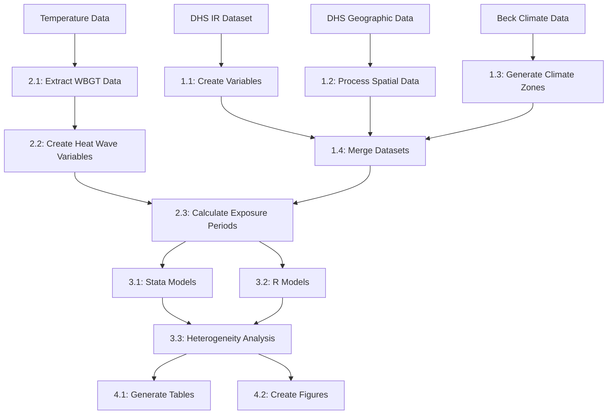

# Effect of Extreme Temperatures on Healthcare Utilization During Pregnancy: Findings from a Nationally Representative Survey in India

This repository contains scripts used to study how extreme temperatures affect maternal healthcare service utilization during pregnancy in India. The following sections describe data sources and scripts needed to replicate the analysis.

# Data Sources
Health outcomes and demographic variables can be obtained from the Demographic and Health Survey (DHS) website by creating an account and submitting an application to use the data.

* DHS dataset (https://www.dhsprogram.com/data/available-datasets.cfm)
  - Individual Recode (IR) dataset: IAIR7EFL.DTA
  - Geographic data: IAGE7AFL.shp
* Beck Climate Classification dataset
  - Available at: Beck_KG_V1_present_0p0083.tif

# Data Processing and Analysis Scripts

## 1. Data Processing Scripts
### [1-scripts/1.1-process-DHS-IR-create-vars](1-scripts/1.1-process-DHS-IR-create-vars.R)
This script processes the DHS Individual Recode (IR) dataset. It loads and selects variables from different domains, converts data from wide to long format, and creates new variables including meta variables, birth-related variables, healthcare contact variables, socioeconomic variables, and COVID-period identifiers. The script filters cases to usual residents only and women in their last three months of pregnancy, creating separate datasets for women in their last 6 and 7 months of pregnancy.

### [1-scripts/1.2-process-DHS-spatial-read-datasets](1-scripts/1.2-process-DHS-spatial-read-datasets.R)
This script handles spatial data processing by reading geo-coded PSU data from the DHS India shapefile and filtering out invalid geocodes. It loads administrative boundaries for India using Natural Earth data and creates a 50km buffer around India's boundary. The processed spatial datasets are saved for further analysis.

### [1-scripts/1.3-process-gen-clim-zone-India](1-scripts/1.3-process-gen-clim-zone-India.R)
This script creates climate zone classifications for Indian districts using Beck's climate classification system and DHS spatial boundaries. It processes Beck's climate classification raster data and extracts climate zones for each district in India. The script creates both detailed and simplified climate zone classifications and assigns monsoon zone classifications.

### [1-scripts/1.4-process-merge-IR-clim-zones](1-scripts/1.4-process-merge-IR-clim-zones.R)
This script merges the climate zone data with the processed IR datasets. It standardizes district and state names between datasets and creates separate merged datasets for 6-month and 7-month pregnancy durations.

## 2. Temperature Data Processing Scripts
### [1-scripts/2.1-process-clim-extract-wbgt-data-to-psus](1-scripts/2.1-process-clim-extract-wbgt-data-to-psus.R)
This script links daily temperature data with DHS PSU locations. It extracts various climate metrics including Wet Bulb Globe Temperature (WBGT) maximum, Dry Bulb Temperature maximum, and precipitation. The script creates separate datasets for complete historical WBGT data, data from 2014 onwards, precipitation data, and maximum temperature data, while handling missing data by identifying and removing PSUs with no temperature data.

### [1-scripts/2.2-create-hw-and-exceedance-vars](1-scripts/2.2-create-hw-and-exceedance-vars.R)
This script processes temperature data to create heat wave and temperature exceedance variables. It creates absolute temperature cutoff variables at 28°C, 30°C, and 32°C WBGT and generates heat wave variables for different consecutive day thresholds ranging from 2 to 5 days. The script also calculates magnitude of temperature exceedance above thresholds.

### [1-scripts/2.3-create-period-exposures-anc-pnc](1-scripts/2.3-create-period-exposures-anc-pnc.R)
This script calculates exposure variables for specific time periods related to healthcare visits. It processes WBGT data and health outcome data to calculate 90-day exposure periods for home visits. The script creates multiple exposure metrics and scales them appropriately, producing final datasets in both R and Stata formats.

## 3. Statistical Analysis Scripts
### [1-scripts/3.1-models-full-6mo](1-scripts/3.1-models-full-6mo.do)
This Stata script performs mixed-effects logistic regression analyses. It processes categorical variables and runs the full model examining the association between temperature exposure and healthcare contact. The script includes effect modification analyses by rural/urban status, healthcare access issues, and wealth status, conducting Wald tests for heterogeneity between subgroups.

### [1-scripts/3.2-models-in-R](1-scripts/3.2-models-in-R.R)
This R script replicates and extends the Stata analyses using mixed-effects modeling capabilities. It creates model formulas for the full model and various stratified analyses, using `glmer` from the `lme4` package. The script includes additional binary categorization of education level and saves models as R objects for further analysis.

### [1-scripts/3.3-models-heterogeniety](1-scripts/3.3-models-heterogeniety.R)
This script analyzes heterogeneity in effect estimates by comparing coefficients between stratified models for rural vs urban areas, different levels of healthcare access, wealth groups, and education levels. It conducts formal statistical tests for heterogeneity using Z-tests and exports results to CSV files.

## 4. Output Generation Scripts
### [1-scripts/4.1-output-table1](1-scripts/4.1-output-table1.R)
This script generates descriptive statistics tables using survey-weighted data. It creates a survey design object and generates tables for socioeconomic variables, rural/urban status, and temperature exposure variables. The script calculates column percentages for healthcare contact, weighted means and standard deviations for maternal age, and weighted percentages for outcome variables.

### [1-scripts/4.2-output-figures](1-scripts/4.2-output-figures.R)
This script creates publication-ready figures visualizing the model results. It processes model outputs and creates multiple visualization types including forest plots for full model results and effect modification plots for various stratifications. The script implements consistent styling across figures and saves high-resolution outputs.

## 5. Utility Functions
### [1-scripts/6.1-function-to-calc-temp-bins](1-scripts/6.1-function-to-calc-temp-bins.R)
This function calculates temperature bins for specified time periods. It processes health and climate datasets to calculate temperature bins across multiple ranges (Below 10°C to Above 30°C) and handles both forward and backward time windows.

### [1-scripts/6.2-function-wtd-comparegroups](1-scripts/6.2-function-wtd-comparegroups.R)
This function generates survey-weighted descriptive statistics for both categorical and continuous variables. It calculates unweighted counts, weighted proportions, and appropriate statistical tests, producing formatted tables with comprehensive statistics.

### [1-scripts/6.3-function-to-plot-models](1-scripts/6.3-function-to-plot-models.R)
This script contains functions for visualizing model results, including comparison of model coefficients, creation of forest plots for main effects, and generation of effect modification plots. The functions support custom color schemes and include comprehensive formatting options.

### [1-scripts/6.4-function-to-calc-cis](1-scripts/6.4-function-to-calc-cis.R)
This function calculates confidence intervals for model coefficients with support for different confidence levels and scale options. It provides flexibility in calculating point estimates and confidence bounds for both odds ratios and linear scales.

# Data Processing Pipeline

# Key Variables Created
The analysis creates several categories of variables:

**Outcome Variables**: Healthcare contact in last 3 months, antenatal care visits, and institutional delivery indicators.

**Geographic Variables**: PSU coordinates, district and state identifiers, and climate zone classifications.

**Socioeconomic Variables**: Wealth indices (binary and quintiles), religion (2-level, 3-level, and 4-level classifications), and caste (2-level, 3-level, and 4-level classifications).

**Temperature Exposure Variables**: WBGT maximum daily values, heat wave events (2-5 consecutive days), temperature exceedance measures, 90-day exposure periods, and scaled exposure metrics.

Note: This repository is part of an ongoing research project. Additional scripts and documentation will be added as the analysis progresses.